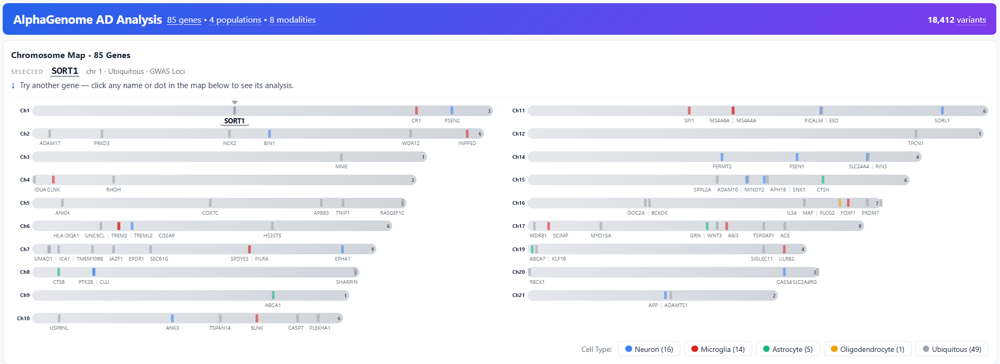
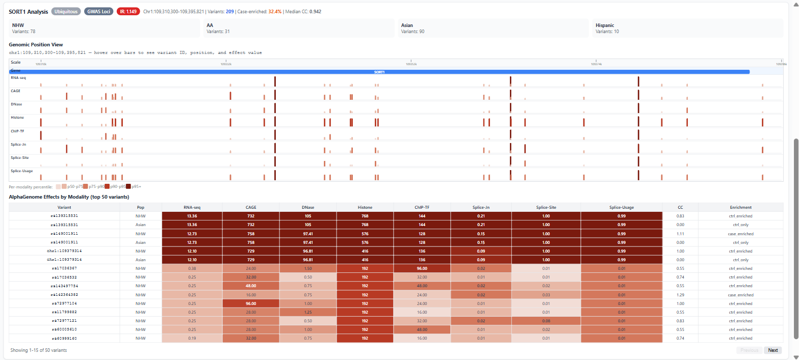

# Rare variants and AlphaGenome-predicted regulatory impact in Alzheimer's disease genes

## Variant browser

### **https://taehojo.github.io/rarevariants/**

Every rare variant in the study, browsable in the page. No download, no install.

[](https://taehojo.github.io/rarevariants/)

The 85 AD-associated genes laid out by chromosome and coloured by cell-type
assignment. Click any gene to open it.

[](https://taehojo.github.io/rarevariants/)

Each gene opens on its own interaction ratio and variant counts per ancestry
stratum, a genomic position view showing where the variants fall and how strong
their predicted effect is in each of the eight modalities, and a sortable table
of per-variant scores with the case-control ratio and enrichment direction.

The browser holds all 18,412 gene-mapped variant records, that is 85 genes
across four ancestry strata before the allele-count filter and deduplication
that define the 9,943-variant analysis set used in the paper.

---

Analysis code for a study of rare-variant regulatory impact in Alzheimer's
disease-associated genes (Jo et al., manuscript under review).

Rare variants (MAF < 1%) in 85 AD-associated genes were scored with AlphaGenome
across eight regulatory modalities and compared against case-control allele
frequencies in 24,595 ADSP R4 participants, with an independent assessment in
11,545 ADSP R5 participants.

## Data

No participant-level or variant-level data are distributed here. Obtain them from:

| Source | Where |
|---|---|
| ADSP R4 / R5 whole-genome sequencing | dbGaP `phs000572` (controlled access; apply through NIAGADS) |
| snRNA-seq / snATAC-seq, prefrontal cortex | GEO `GSE174367` |
| ChromHMM 15-state, 8 brain epigenomes | https://egg2.wustl.edu/roadmap/ |
| cis-eQTL, whole blood | https://www.eqtlgen.org |
| cis-eQTL, brain (v10) | https://gtexportal.org |
| GWAS lead variants | Bellenguez et al. 2022, Supplementary Table 5, doi:10.1038/s41588-022-01024-z |
| Gene annotation | GENCODE v38, GRCh38 |

Place downloads under `data/` and pass paths on the command line.

Two files are included: `data/Table_S1_gene_list.csv` (the 85 genes, with the
cell-type category counted once per gene) and `data/cell_type_dictionary.csv`
(the full curated dictionary, 89 entries over 87 genes). The number in the
first filename is historical and does not correspond to any table number in the
current manuscript. See `data/README.md`.

`data/Table_S2_variant_data.csv` holds the 9,943 analysed variants with their
AlphaGenome scores and case-control summary statistics, the same table served by
the browser at https://taehojo.github.io/rarevariants/ . It contains no
individual-level genotypes.

## Pipeline

Each script corresponds to one stage of the analysis reported in the manuscript.

| Script | Analysis stage | Outputs |
|---|---|---|
| `01_extract_rare_variants.py` | Rare-variant extraction per ancestry stratum (PLINK 2.0, MAF < 1%) and mapping to the 85 gene regions (promoter -5 kb to +1 kb of the 3' end) | variant table |
| `02_alphagenome_predict.py` | AlphaGenome API scoring, eight regulatory modalities, one scalar per variant per modality | scored variant table |
| `03_interaction_ratio.py` | Primary interaction ratio, top-20% split with ties assigned high; allele-count and percentile sweeps; decile dose-response; top-20% versus median split | Table 2; Supplementary Tables S5, S7 A-C, S8 |
| `04_clustering_models.py` | Within-gene clustering: GEE under independence and exchangeable working correlations, and rank-based inverse normal regression with gene-clustered standard errors | Supplementary Tables S19, S23 |
| `05_permutation_specificity.py` | Size-matched null of 1,000 random 85-gene sets drawn from the non-AD AlphaGenome universe | Supplementary Table S27 |
| `06_noncoding_strata.py` | VEP v110 three-strata analysis: all variants, protein-altering excluded, non-coding only | Supplementary Table S22 |
| `07_r5_assessment.py` | Independent ADSP R5 assessment. Population-proportional control subsampling to the R4 case-to-control ratio of 1:2.9, 100 iterations, seed 42, cases held fixed and controls drawn without replacement; reports the median and the 2.5th-97.5th percentile band as a control-subsampling robustness interval | Supplementary Tables S11, S18 |
| `08_snatac_concordance.py` | Concordance of predicted DNase effects with measured snATAC-seq accessibility, GSE174367 | Supplementary Table S13; Figure S6 |
| `09_chromhmm_enrichment.py` | ChromHMM 15-state enrichment across eight brain epigenomes | Supplementary Tables S14a, S14b; Figure S7 |
| `10_bellenguez_concordance.py` | Direction concordance between per-gene interaction ratios and Bellenguez lead-variant odds ratios | Supplementary Table S20 |

`03_interaction_ratio.py` is the entry point and reproduces the primary result:

```
pip install -r requirements.txt
python code/03_interaction_ratio.py --variants data/variant_table.csv --outdir results/paper_tables
```

Its outputs in `results/paper_tables/` are the values printed in the paper. The
analysis set is variants with allele count >= 3, deduplicated on
chromosome:position:REF:ALT, carrying all four primary AlphaGenome scores and a
finite case-control ratio (n = 9,866); case-only variants are excluded.

Scripts 01, 04, 05, 06, 09 and 10 still carry absolute paths from the machine
the analysis ran on. Edit the path constants at the top of each before running;
the file layout there does not match this repository.

## Requirements

Python >= 3.8 with the packages in `requirements.txt`. PLINK 2.0 for script 01,
Ensembl VEP v110 for script 06.

## Related

- AlphaGenome MCP server: https://github.com/taehojo/alphagenome-mcp
